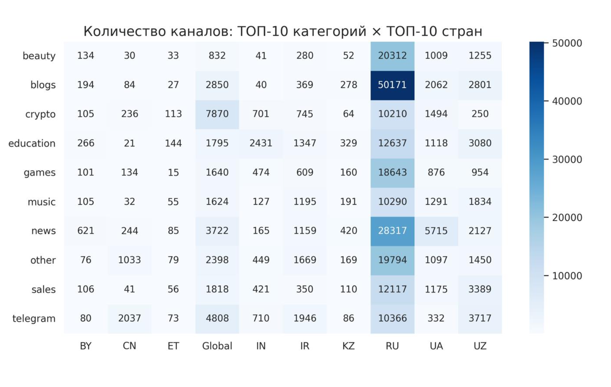
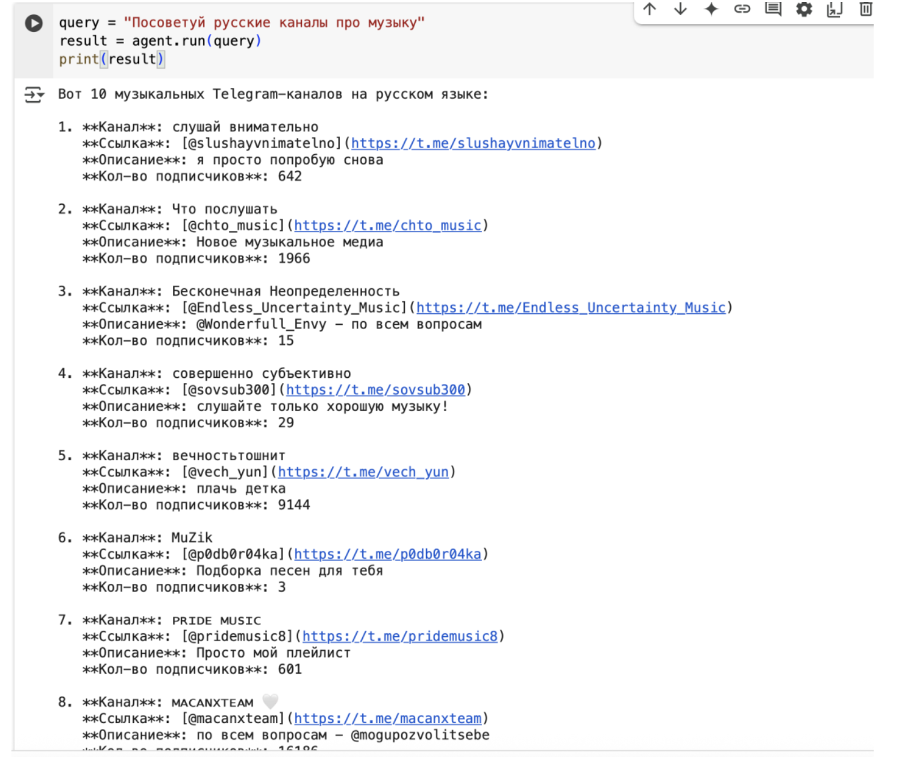
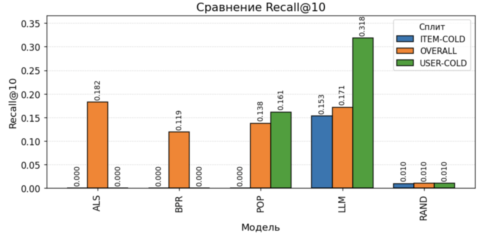
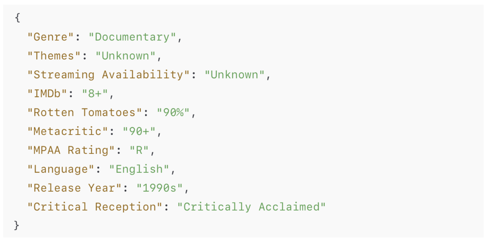
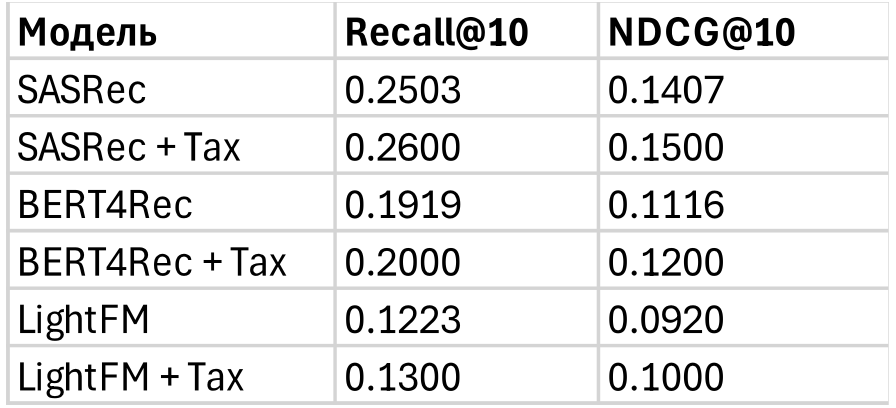

# LLM4RECSYS

`LLM4RECSYS` — это набор экспериментов и инструментов для построения рекомендательных систем с использованием языковых моделей (LLMs), гибридных моделей и семантических таксономий. Репозиторий разделен на несколько тематических модулей.

---

##  Структура проекта

### `ChannelRecommender/`

Модуль, фокусирующийся на рекомендации Telegram-каналов.

- **`combined_df.csv`** — агрегированный датасет каналов и пользовательских взаимодействий.
- **`recommender_agent.ipynb`** — ноутбук с реализацией агента на основе LLM для рекомендаций каналов.
- **`telegram_channels_e5.index`** — Faiss-индекс эмбеддингов Telegram-каналов, построенный с использованием модели типа E5.

Пример работы с агентом:

---

### `ColdStart/`

Методы решения проблемы холодного старта (отсутствие истории взаимодействий).

- **`cold_start_pipeline.ipynb`** — pipeline, включающий генерацию признаков, embedding-модели и рекомендации на основе LLM или мета-признаков.

---

### `Tax4Rec/`

Система рекомендаций на основе таксономий и признаков предметной области (например, фильмы и жанры).

- **`item_features.csv`** — csv-файл с признаками объектов (фильмов) для построения рекомендаций.
- **`LightFM.ipynb`** — реализация гибридной рекомендательной модели с использованием библиотеки LightFM.
- **`ml100k.inter`** — файл с пользовательскими взаимодействиями из набора MovieLens 100k.
- **`ml100k.item`** — файл с описаниями фильмов (жанры, названия и т.д.).
- **`movie_taxonomy_10feats_temp.json`** — JSON-файл с иерархией признаков и категорий (таксономией) фильмов.
- **`TaxRec.ipynb`** — ноутбук для построения рекомендательной модели, учитывающей таксономическую информацию и генерацию признаков через LLM.

Пример сгенерированной таксономии признаков для одного айтема:

Метрики качества после аугментации данных:

---